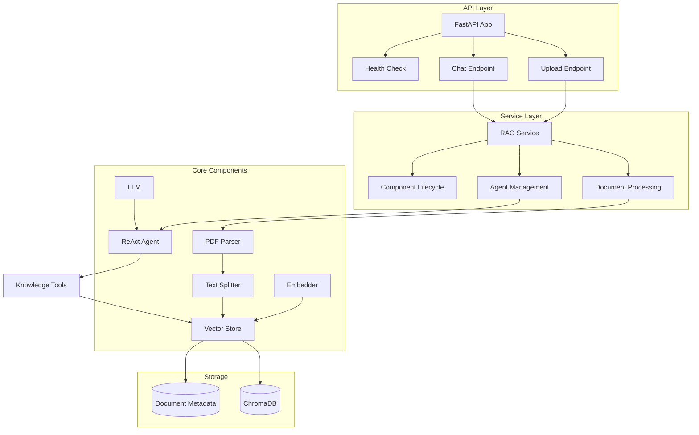
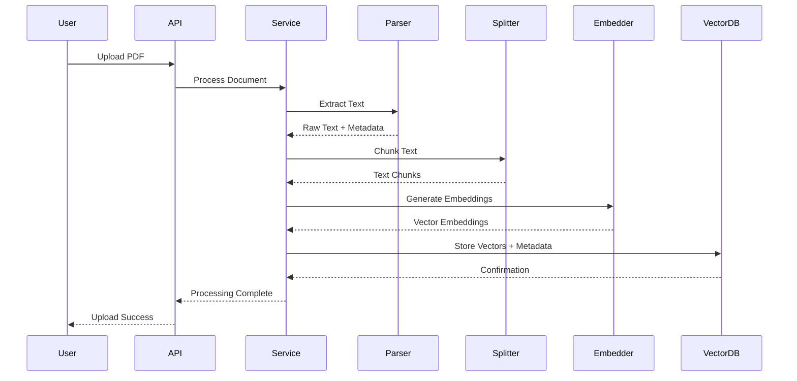
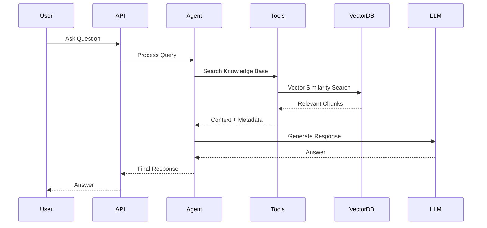

# PDF RAG Agent

A sophisticated Retrieval-Augmented Generation (RAG) system that enables intelligent querying of PDF documents using state-of-the-art language models and vector search.

## System Architecture



## Document Processing Flow



## Query Processing Flow



## Component Architecture

### API Layer

**FastAPI Application** (`main.py`)
- Entry point for the web service
- Exception handling for document processing and agent errors
- Health check endpoint and API documentation

**API Endpoints** (`api.py`)
- Document upload endpoint with background processing
- Agent chat endpoint for querying the knowledge base
- Clean separation of web concerns from business logic

**Configuration** (`config.py`)
- Environment-based configuration using Pydantic
- Secure handling of API keys and service settings
- Type-safe configuration management

### Service Layer

**RAG Service** (`services.py`)
- Central orchestration through `RAGService` class
- Document processing pipeline coordination
- Agent invocation handling
- Component initialization and lifecycle management

### Core Processing Components

**Document Parser** (`core/parser.py`)
- Extracts text from PDF documents using PyPDF2/pdfplumber
- Preserves document structure and formatting
- Handles metadata extraction (title, author, creation date)
- Error handling for corrupted or encrypted PDFs

**Text Splitter** (`core/splitter.py`)
- Chunks text into semantic units for optimal retrieval
- Maintains context windows with configurable overlap
- Preserves sentence and paragraph boundaries
- Optimizes chunk size for embedding model limits

**Vector Store** (`core/vector_store.py`)
- ChromaDB integration for persistent vector storage
- Efficient similarity search with metadata filtering
- Document versioning and update capabilities
- Batch operations for performance optimization

### Model Components

**Embedder** (`models/embedder.py`)
- Google's Generative AI embeddings integration
- Consistent vector representations for semantic search
- Batch processing for efficient embedding generation
- Retry logic and rate limiting

**Language Model** (`models/llm.py`)
- Groq LLM integration with multiple model support
- Configurable generation parameters (temperature, max tokens)
- Streaming response capabilities
- Error handling and automatic retries

### Agent System

**Agent Management** (`agent/agent.py`)
- ReAct (Reasoning + Acting) agent implementation
- Tool selection and execution logic
- Multi-step reasoning capabilities
- Response synthesis and formatting

**Knowledge Tools** (`agent/tools.py`)
- Vector store search tools with similarity thresholds
- Document-specific querying with metadata filters
- Context aggregation and ranking
- Response formatting and citation generation

## Project Structure

```
pdf-rag-agent/
├── app/
│   ├── main.py              # FastAPI application entry point
│   ├── api.py               # REST API endpoints
│   ├── config.py            # Environment configuration
│   ├── services.py          # Business logic orchestration
│   ├── core/
│   │   ├── parser.py        # PDF text extraction
│   │   ├── splitter.py      # Text chunking strategies
│   │   └── vector_store.py  # ChromaDB integration
│   ├── models/
│   │   ├── embedder.py      # Google Generative AI embeddings
│   │   └── llm.py           # Groq LLM integration
│   └── agent/
│       ├── agent.py         # ReAct agent configuration
│       └── tools.py         # Knowledge retrieval tools
├── requirements.txt
└── .env                     # Environment variables
```

## Quick Start

1. **Setup Environment**
   ```bash
   pip install -r requirements.txt
   ```

2. **Configure API Keys**
   ```env
   GROQ_API_KEY=your_groq_api_key
   GOOGLE_API_KEY=your_google_api_key
   LANGSMITH_API_KEY=your_langsmith_api_key
   ```

3. **Run Application**
   ```bash
   uvicorn app.main:app --reload
   ```

4. **Access API Documentation**
   - Interactive docs: `http://localhost:8000/docs`
   - Health check: `http://localhost:8000/health`

## API Usage

### Upload Document
```bash
curl -X POST "http://localhost:8000/api/upload" \
     -F "file=@document.pdf"
```

### Query Documents
```bash
curl -X POST "http://localhost:8000/api/agent/chat" \
     -H "Content-Type: application/json" \
     -d '{"question": "What are the key findings in the document?"}'
```

## Key Features

- **Intelligent Document Processing**: Advanced PDF parsing with metadata preservation
- **Semantic Search**: Vector-based similarity search using Google's embeddings
- **Conversational Interface**: ReAct agent for natural language interactions
- **Scalable Architecture**: Modular design for easy extension and maintenance
- **Production Ready**: Comprehensive error handling and monitoring capabilities

## Configuration Options

| Variable | Description | Default |
|----------|-------------|---------|
| `GROQ_MODEL_NAME` | LLM model selection | `llama3-70b-8192` |
| `EMBEDDING_MODEL_NAME` | Embedding model | `models/embedding-001` |
| `CHROMA_PERSIST_DIR` | Vector store location | `./chroma_db` |
| `CHROMA_COLLECTION_NAME` | Collection name | `pdf_documents` |

## Technology Stack

- **API Framework**: FastAPI
- **Vector Database**: ChromaDB
- **Embeddings**: Google Generative AI
- **Language Model**: Groq (Llama 3)
- **Agent Framework**: LangChain ReAct
- **Document Processing**: PyPDF2/pdfplumber